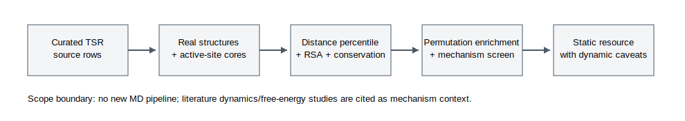
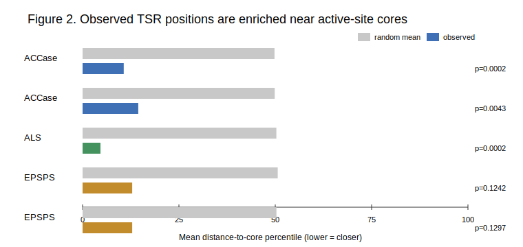
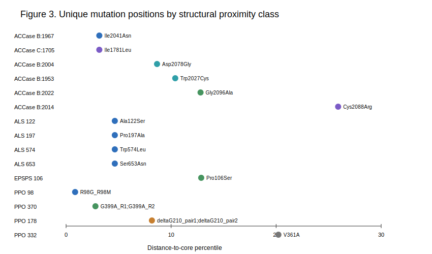
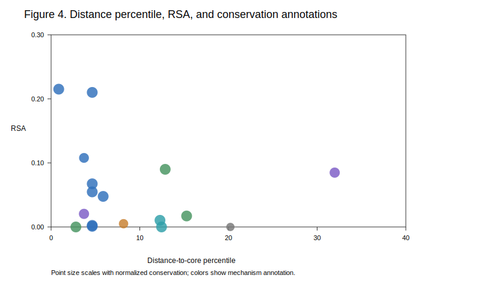

# Comparative Static Structural Mapping of Target-Site Herbicide Resistance Across Weed Enzyme Families

Status: first manuscript draft for internal review. This draft is built from the current Phase 4 outputs and should be citation-polished before submission.

## Abstract

Target-site herbicide resistance is usually studied one enzyme family at a time, which makes it difficult to compare whether resistance substitutions occupy similar structural zones across unrelated herbicide targets. Here, we built a comparative static structural-bioinformatics resource for verified weed target-site resistance positions in protoporphyrinogen oxidase (PPO), acetolactate synthase/acetohydroxyacid synthase (ALS/AHAS), 5-enolpyruvylshikimate-3-phosphate synthase (EPSPS), and acetyl-CoA carboxylase (ACCase), with 4-hydroxyphenylpyruvate dioxygenase (HPPD) retained as a contrast family after source audit found no accepted weed-evolved target-site amino-acid substitution for inclusion.

For each accepted mutation position, we mapped the site onto a ligand-bound or otherwise herbicide-relevant protein structure, defined an active-site core from ligand or validated pocket contacts, and calculated within-family distance-to-core percentile, raw solvent-accessible surface area, Tien-normalized relative solvent accessibility (RSA), and alignment-based conservation. We then de-duplicated repeated accession rows to unique structural positions and tested whether accepted resistance positions are enriched near active-site cores relative to random same-family residue sets.

Accepted resistance positions were strongly enriched in low distance-to-core percentiles for PPO, ALS/AHAS, and ACCase. ACCase showed an observed mean percentile of 13.24 versus a random mean of 50.20 (empirical p = 0.000300), ALS/AHAS 4.64 versus 50.10 (p = 0.000100), and PPO 8.01 versus 49.90 (p = 0.000600). Critically, the enrichment is not an artifact of direct-contact residues scoring zero by construction: when the direct-core positions are removed and only non-core accepted positions are tested, the signal survives for both PPO (n = 3, observed 10.39, p = 0.004100) and ACCase (n = 4, observed 18.00, p = 0.010199). EPSPS showed the same directional pattern for Pro106Ser (12.87 versus 50.11) but is underpowered as a family-level test because the current accepted set contains one mutation position. Mechanism annotation separated direct-core substitutions from adjacent, second-shell/channel, and interface-associated positions, preventing static proximity from being overinterpreted as a binding free-energy model. ACCase was evaluated on a SWISS-MODEL black-grass CT-domain homodimer built from AJ310767 residues 1639-2204 on the inhibitor-bound 1UYS template; because SWISS-MODEL excluded haloxyfop, active-site-core membership was transferred from aligned 1UYS H1L-contact residues.

That accepted TSR positions sit near the active site is expected — it is close to the definition of target-site resistance — so proximity enrichment is treated here as a baseline to be established and then moved past, not as the finding. The contribution of the resource is a reproducible cross-family *typology* of how resistance positions relate to the pocket: direct-contact substitutions, binding-site-adjacent and second-shell/channel positions, a deletion-linked helix case (PPO ΔG210), a poorly conserved permissive site (PPO V361A), and distal dimer-interface positions (ACCase Cys2088Arg). The non-core positions — those not explained by direct contact — are the mechanistically informative core of the paper and are where static mapping adds value beyond restating that pocket mutations are in the pocket. Static distance, RSA, and conservation identify where resistance positions sit; literature kinetic, docking, molecular-dynamics, and free-energy studies remain necessary to explain how specific substitutions alter binding, catalysis, conformational sampling, or herbicide selectivity.

## Introduction

Target-site resistance (TSR) remains one of the clearest molecular routes by which weeds survive herbicide selection. A single amino-acid substitution or deletion can reduce herbicide sensitivity while preserving enough enzyme function for plant survival. The most familiar examples are usually discussed within individual site-of-action families: PPO deletions or substitutions, ALS/AHAS pocket mutations, EPSPS Pro106 substitutions, and ACCase carboxyltransferase-domain substitutions. This family-by-family framing is useful for diagnosis, but it leaves a comparative question unresolved: do accepted TSR positions occupy a recurring structural landscape across unrelated herbicide targets?

Existing structural and biochemical work already shows that resistance mechanisms are not limited to direct ligand-contact replacements. Some positions sit in the binding pocket itself, while others act through adjacent loops, channel geometry, helix packing, allosteric opening/closing motions, or dimer-interface induced-fit effects. A purely static distance metric cannot reproduce those dynamic mechanisms. However, static structure can still answer a different and tractable question: whether known resistance positions occupy unusually close, conserved, or exposed/buried structural zones relative to the rest of the enzyme family.

This project was designed as a comparative static structural-bioinformatics resource, not as a mutant-state molecular dynamics or binding free-energy prediction engine. The goal is to standardize mutation curation, structure selection, active-site-core definition, distance percentile, RSA, and conservation across enzyme families, then use those outputs to identify broad enrichment patterns and mechanistically interesting exceptions. Where literature has already established dynamic or kinetic explanations, those studies are used as interpretation benchmarks rather than reimplemented.

We are explicit about what is expected versus what is novel. That accepted TSR positions cluster near the active-site core is the expected result, and for direct-contact residues it is nearly tautological because the core is defined by ligand contact. The intended contribution is therefore not the enrichment itself but the standardized, reproducible framework that (i) confirms the enrichment survives after removing guaranteed-zero direct-core positions, and (ii) resolves the accepted positions into a small typology of structural relationships to the pocket, foregrounding the non-obvious, non-contact cases that a single "near the active site" statement obscures.

We piloted and validated the workflow on PPO, then extended it to ALS/AHAS, EPSPS, ACCase, and HPPD. HPPD was retained differently: a primary-source audit found no accepted weed-evolved HPPD target-site amino-acid substitution suitable for the pooled TSR mutation table, so HPPD is included as a structural contrast case rather than forced into a false-positive mutation analysis.

## Materials and Methods

### Source Curation and Mutation Inclusion

Mutation rows were included only when supported by primary literature or accession-level evidence consistent with project curation rules. PPO, ALS/AHAS, EPSPS, and ACCase were represented by accepted weed target-site resistance positions. Repeated accessions or biological rows mapping to the same structural residue were retained in the master traceability table but de-duplicated to unique structural positions for the Phase 4 enrichment test.

The curation workflow intentionally avoided accession inference by sequence-length matching, pattern guessing, or elimination. When accessions were absent from visible source text, the mutation could remain as a literature-supported row if the paper itself established the amino-acid change, but it was not assigned a fabricated accession. Unpublished or lower-confidence contextual sequences were not used as manuscript-reliant anchors.

### Structure Selection

Each target family was mapped to a real protein structure selected for herbicide relevance, ligand state, plant/source relevance where possible, and interpretability of the active-site zone.

PPO used the tobacco mitochondrial PPO2 structure 1SEZ. ALS/AHAS used 1Z8N with an interface-aware active-site core. EPSPS used maize EPSPS structure 8UMJ complexed with glyphosate and shikimate-3-phosphate. ACCase used a SWISS-MODEL black-grass carboxyltransferase-domain homodimer built from AJ310767 residues 1639-2204 on the yeast 1UYS template, preserving the dimer context needed for ACCase resistance-site interpretation. HPPD used Arabidopsis plant HPPD structures, especially 5YWG with mesotrione and metal, as a contrast structural module.

### Active-Site Core Definitions

Active-site cores were defined by family-specific structural evidence rather than a single arbitrary residue list. Ligand-contact cores were generated from residues within the adopted contact threshold around bound herbicides, substrates, cofactors, or metals when those ligands were present and relevant. For PPO, the validated Heinemann active-site reference was retained as the primary core. For ALS/AHAS, the core was expanded after review to include dimer-interface pocket residues, including the Ala122/Pro197 zone, because ALS inhibitor binding is not confined to a single-chain pocket.

The primary cross-family distance field is `distance_to_active_site_core_A`, where direct core residues have distance 0 A. A secondary nearest-other-core spacing field is retained where useful but is not the pooled distance metric.

### Distance Percentile, RSA, and Conservation

For every residue in each structure, the pipeline calculated distance to the active-site core and converted that value to a within-family percentile rank. This makes enzymes of different sizes and architectures comparable: a low percentile means a residue lies unusually close to the active-site core within its own protein.

Solvent exposure is recorded as both raw solvent-accessible surface area (`sasa_A2`) and Tien-normalized relative solvent accessibility (`rsa_tien2013`). Raw SASA is retained for traceability, while RSA is preferred for cross-enzyme comparisons because residue type affects maximum accessible area.

Conservation was estimated from curated multi-species sequence panels using alignment-based Shannon entropy and normalized conservation scores. Conservation values are interpreted as supporting structural constraint, not as direct evidence of herbicide resistance by themselves.

### Phase 4 Enrichment Analysis

For PPO, ALS/AHAS, EPSPS, and ACCase, accepted mutation rows were joined to their family-specific distance, RSA, and conservation tables. Rows were then collapsed to unique structural positions for the enrichment test so that repeated source rows did not overweight a single residue.

Within each family, the observed mean distance-to-core percentile for accepted resistance positions was compared against 10,000 random same-size residue sets drawn from that family structure. The empirical lower-tail p-value measures how often random residue sets are at least as close to the active-site core as the observed accepted positions. The randomization seed was 20260704. To guard against the enrichment being driven by direct-contact residues that score zero distance by construction, the test was run twice per family: once on all accepted positions (`all`) and once on non-core positions only (`non_core_only`), the latter removing the guaranteed-zero direct-core residues.

### Template and Homology-Model Transparency

Because structures were selected for herbicide relevance rather than exact species match, the mapped structure residue is not always guaranteed to be the same amino acid as the weed residue. The master table records `weed_wt_residue`, `template_residue`, `template_matches_weed_residue`, and `template_is_resistant_state` for every position. PPO, ALS/AHAS, EPSPS, and the current ACCase SWISS-MODEL rows all match the weed wild-type residue at the accepted positions. ACCase remains model-based rather than experimentally solved: the black-grass CT-domain dimer was homology-modeled on 1UYS, and the ligand-contact core was transferred from 1UYS because SWISS-MODEL excluded H1L. Thus ACCase SASA/RSA are weed-sequence homology-model metrics, not direct crystal-observed side-chain measurements.

### Mechanism Annotation

Each unique mutation position was assigned a controlled mechanism label: `direct_core`, `adjacent`, `second_shell_channel`, `allosteric_hinge`, `interface_induced_fit`, or `unresolved_static_candidate`. These labels are interpretive annotations, not new mechanistic proofs. Literature-supported labels were used when prior biochemical, kinetic, docking, molecular-dynamics, or structural work supported the mechanism class. Static-supported unresolved positions were not promoted to high-confidence dynamic mechanisms.

## Results

### Workflow and Dataset Scope

The pipeline links source-verified TSR curation, structure selection, active-site-core definition, residue-level static metrics, family-level permutation testing, and mechanism annotation (Figure 1). The current pooled TSR table contains PPO, ALS/AHAS, EPSPS, and ACCase mutation rows. HPPD is retained separately as a contrast family because the source audit did not identify an accepted weed-evolved HPPD TSR amino-acid substitution suitable for mutation-row pooling.

### Accepted TSR Positions Are Enriched Near Active-Site Cores

We first establish the expected baseline before turning to the informative exceptions. Across the current target families, accepted TSR positions fall much closer to active-site cores than random same-family residues (Figure 2; Table 1). ACCase had six unique mutation positions with an observed mean percentile of 13.24, compared with a random mean of 50.20 (empirical p = 0.000300). ALS/AHAS had four unique positions (all direct-core) with an observed mean percentile of 4.64 versus 50.10 (p = 0.000100). PPO had four unique positions with an observed mean percentile of 8.01 versus 49.90 (p = 0.000600).

This enrichment is expected for direct ligand-contact residues, which score zero distance by the core definition, so it is important that the signal is not merely re-stating that definition. When the direct-core positions are removed and only non-core accepted positions are tested, the enrichment persists: PPO non-core positions (n = 3) have an observed mean percentile of 10.39 (p = 0.004100) and ACCase non-core positions (n = 4) 18.00 (p = 0.010199). ALS/AHAS has no non-core accepted position in the current set (Trp574, Ser653, Ala122, and Pro197 are all direct-core interface-pocket residues), so no non-core test is reported for it. The persistence of enrichment among non-core positions is the non-tautological form of the result and is the more informative finding.

EPSPS followed the same directional pattern: Pro106Ser lies at the 12.87th percentile relative to the glyphosate/S3P active-site core, compared with a random mean of 50.57. However, because the current accepted EPSPS set contains one unique position, the EPSPS p-value is best treated as descriptive and underpowered rather than as evidence for absence of enrichment.

### A Structural Typology of Resistance Positions (the main contribution)

The core contribution of this resource is not the enrichment above but the reproducible typology it enables: resolving accepted positions by *how* they relate to the pocket rather than only *whether* they are near it. The unique-position screen separates direct-core substitutions from adjacent, second-shell/channel, and more distal non-core candidates (Figure 3; Table 2). Direct-core examples include PPO R98G/R98M, ALS/AHAS Trp574Leu, Ser653Asn, Ala122Ser, and Pro197Ala, and ACCase Ile2041Asn under the current active-site-core definitions. These positions are useful positive controls: static proximity is expected to be informative because the residues lie in or at the validated binding pocket. They anchor one end of the typology but are not, on their own, a finding.

The non-core positions are the more mechanistically informative part of the resource. PPO DeltaG210 is adjacent to the active-site zone but is better interpreted through deletion-linked helix or loop effects than through distance alone. EPSPS Pro106Ser is close to the glyphosate/S3P site but sits just outside the 4.5 Å atomic-contact core; it is a binding-site-associated (second-shell) residue — the substitution corresponds to the *Salmonella typhimurium* glyphosate-insensitive EPSPS change (Baerson et al. 2002) and reduces glyphosate affinity — and its non-core classification reflects the contact-distance cutoff, not evidence of allostery. ACCase Cys2088Arg is the most distal accepted ACCase position in the current screen; it remains within the broader dimer-interface resistance zone, and the SWISS-MODEL residue is the expected weed wild-type cysteine. Its remaining caveat is that ACCase active-site-core membership is transferred from the ligand-bound 1UYS template because the homology model itself lacks H1L.

For interpretation benchmarks, the flagship non-core cases now map cleanly to source-supported mechanisms: Dayan et al. 2010 provides the kinetic/MD benchmark for PPO DeltaG210, Hao et al. 2009 is retained as the secondary computational account, and the ACCase CT-domain interpretation is grounded in Delye et al. 2005, Yu et al. 2007, and the inhibitor-bound 1UYS structure from Zhang et al. 2004.

### RSA and Conservation Add Context Without Replacing Mechanism

Distance percentile, RSA, and conservation jointly describe the structural context of each accepted position (Figure 4). Many accepted positions are both close to the active-site core and highly conserved, consistent with the expectation that TSR often arises at constrained functional sites where limited changes can alter herbicide response. However, these metrics are not interchangeable. A conserved adjacent residue may mark a mechanically important pocket feature, while a less-conserved non-core position may be a permissive site whose resistance mechanism remains unresolved.

PPO V361A illustrates this caution. The static screen places it outside the immediate core, but its conservation score is modest relative to stronger mechanistic examples. It remains a valid resistance mutation row, but the current resource labels it as an unresolved static candidate rather than assigning a literature-supported dynamic mechanism.

### HPPD Is a Contrast Family, Not a Forced TSR-Positive Dataset

HPPD was not pooled into the mutation enrichment analysis because the project source audit found no accepted weed-evolved HPPD target-site amino-acid substitution suitable for inclusion. Instead, HPPD is represented by plant HPPD active-site metrics and a status table documenting `no_verified_weed_tsr_accepted` with zero accepted TSR rows (Table 3).

This contrast is important for the manuscript's credibility. It shows that the resource does not force every herbicide target into a TSR-positive framework when the literature points instead toward non-target-site mechanisms such as metabolism, expression changes, or polygenic detoxification.

## Discussion

This comparative analysis supports a structural-zone enrichment view of target-site herbicide resistance. Across PPO, ALS/AHAS, and ACCase, accepted TSR positions are concentrated in low within-family distance-to-core percentiles, despite major differences in enzyme architecture, herbicide chemistry, and resistance literature. EPSPS is directionally consistent but currently represented by one accepted position, so it is best used as a mapped case study rather than a family-level statistical result.

The main contribution is not that every resistance mutation directly contacts herbicide. That would be too narrow and, for several important cases, wrong. Instead, the resource shows that accepted positions cluster within an active-site-associated structural landscape that includes direct pocket residues, adjacent residues, second-shell or channel positions, allosteric/hinge positions, and dimer-interface induced-fit sites. This framing preserves both the quantitative enrichment signal and the mechanistic diversity emphasized by prior family-specific studies.

The review-driven static-versus-dynamic critique is therefore incorporated as a scope boundary. Static metrics can identify where a residue sits, whether that position is unusually close within its family, how exposed it is, and how conserved it appears across a curated sequence panel. Static metrics cannot estimate mutant binding free energy, induced-fit cost, loop breathing, solvent rearrangement, altered catalytic turnover, or cross-herbicide selectivity. Those questions require biochemical assays, docking, molecular dynamics, free-energy calculations, or other mechanism-specific studies.

PPO DeltaG210 is the clearest example of why the manuscript should pair static mapping with literature mechanism annotation. The position is close enough to the active-site zone to be captured by the enrichment framework, but the deletion's biological meaning depends on helix-capping destabilization, active-site cavity expansion, and altered inhibition behavior reported by Dayan et al. 2010; Hao et al. 2009 is retained as a secondary computational benchmark because it proposed a different hydrogen-bond mechanism that Dayan et al. later critiqued. PPO R98G/R98M anchors the opposite end of the typology: a direct pocket residue whose interpretation is supported by substrate-recognition and docking work on the PPO active-site region (Heinemann et al. 2007; Hao et al. 2013). ACCase provides a third benchmark class. Delye et al. 2005 modeled black-grass CT-domain substitutions around the inhibitor-binding cavity and distinguished direct APP-interference, bottom-of-cavity second-shell positions, and broader APP/CHD effects, while Zhang et al. 2004 supplies the inhibitor-bound CT-domain template used here and Yu et al. 2007 verifies Cys2088Arg as an accepted ACCase resistance substitution. EPSPS Pro106Ser similarly illustrates a close but non-direct position whose interpretation depends on EPSPS conformational and glyphosate-site literature.

By keeping HPPD as a contrast family, the analysis also avoids overextending the TSR framework. HPPD-inhibitor resistance in weeds is often explained by non-target-site processes, and no accepted weed-evolved HPPD amino-acid TSR row was identified for this resource. The contrast table makes that absence visible rather than hiding it as missing data.

## Limitations

This study is a static structural resource. It does not model mutant-state ensembles, free-energy changes, herbicide-specific resistance factors, metabolism, expression, copy-number variation, or field-level resistance evolution. Distance-to-core percentile is a structural-context metric, not a causal mechanism by itself.

The current EPSPS dataset is underpowered for family-level inference because it contains one accepted mutation position. The current ALS/AHAS set contains four accepted positions (Trp574Leu, Ser653Asn, Ala122Ser, Pro197Ala). Ala122Ser is included at medium confidence because in its source deposit it co-occurs with a second substitution (A282D); Pro197Ala was detected in Palmer amaranth together with Trp574Leu (Singh et al. 2018) but Pro197 is independently one of the most firmly established ALS TSR sites. Asp376, although an accepted ALS TSR locus in other species, was not added because no Palmer amaranth primary source detecting it is in hand (Singh et al. 2018 lists it only as a known locus). Adding Asp376 from a verified weed source, and paired resistant/susceptible accessions for the reference-numbered positions, would further strengthen the family-level section.

Mechanism annotations are only as strong as their evidence level. Rows marked `literature_supported` can be discussed as literature-supported mechanism classes; rows marked `static_supported` or unresolved should not be treated as proven dynamic mechanisms.

A specific structural caveat still applies to ACCase, but it is now a homology-model caveat rather than a yeast-side-chain identity caveat. Its only ligand-bound carboxyltransferase template is the yeast 1UYS structure, which is ~53% identical to the modeled black-grass CT-domain sequence. We therefore built a SWISS-MODEL weed CT-domain homodimer on 1UYS and recomputed distance, SASA, and RSA on weed-sequence residues. The model has good global support for this use (GMQE 0.76; QMEANDisCo global 0.72 ± 0.05), but SWISS-MODEL excluded haloxyfop because the binding site was not conserved under its ligand-transfer rules. The active-site core was therefore transferred from aligned 1UYS H1L-contact residues. ACCase side-chain metrics should be read as homology-model-derived structural context, not as measurements from an experimentally solved weed ACCase complex.

Finally, structure choice and active-site-core definition affect the output. The project reduces this risk by documenting each family-specific decision, preserving source files and scripts, using within-family percentiles rather than raw distance across enzymes, running the enrichment both with and without direct-core positions, and recording HPPD as a contrast case rather than fabricating mutation rows.

## Data and Code Availability

All curated datasets, scripts, generated tables, generated SVG figures, decision records, and verification logs are maintained in the project repository. The key outputs for this draft are:

- `output/tables/phase4_master_mutation_table.csv`
- `output/tables/manuscript_table_1_family_permutation_summary.csv`
- `output/tables/manuscript_table_2_unique_position_mechanisms.csv`
- `output/tables/manuscript_table_3_hppd_contrast_status.csv`
- `output/figures/figure_1_workflow.svg`
- `output/figures/figure_2_permutation_enrichment.svg`
- `output/figures/figure_3_position_screen.svg`
- `output/figures/figure_4_distance_rsa_conservation.svg`
- `data/raw/ACCase_Alopecurus_AJ310767_CTdomain_SWISSMODEL_1UYS_homomer.pdb`
- `data/processed/accase_swissmodel_1uys_distance_sasa.csv`

## Tables

Table 1. Family-level permutation summary. Source file: `output/tables/manuscript_table_1_family_permutation_summary.csv`.

Table 2. Unique mutation-position mechanism annotations. Source file: `output/tables/manuscript_table_2_unique_position_mechanisms.csv`.

Table 3. HPPD contrast/status summary. Source file: `output/tables/manuscript_table_3_hppd_contrast_status.csv`.

## Figure Captions

Figure 1. Workflow and target families. The resource begins with source-verified mutation curation, maps accepted TSR positions to herbicide-relevant protein structures, defines active-site cores, calculates distance percentile/RSA/conservation, runs within-family permutation enrichment, and adds mechanism annotations. HPPD is retained as a contrast family with no accepted weed-evolved TSR mutation row.

Figure 2. Observed versus random distance-to-core percentile by family. Accepted TSR positions in PPO, ALS/AHAS, and ACCase have much lower observed mean distance percentiles than same-size random residue sets sampled from the same family structures. EPSPS is directionally consistent but underpowered because it currently contains one accepted position.

Figure 3. Unique mutation-position screen. Direct-core positions are separated from adjacent and non-core candidates so that the manuscript can distinguish direct ligand-pocket substitutions from mechanistically interesting second-shell, hinge, deletion, or interface-associated positions.

Figure 4. Distance percentile versus RSA and conservation. The scatter view shows how accepted positions combine active-site proximity, solvent exposure, and conservation. These static metrics provide structural context but do not replace literature-supported dynamic or biochemical mechanism evidence.

Figure 5. Resistance-zone map. One lane per enzyme family; each accepted position is placed by its within-family distance-to-core percentile (left = closest to the ligand-contact core) and colored by mechanism label. The shaded left band marks the direct-contact core zone. This schematic view summarizes the typology: ALS positions cluster in the direct-contact zone, PPO and ACCase span direct-core through second-shell/adjacent to more distal interface positions, and EPSPS Pro106Ser sits just outside the contact core. A structure-rendered version (per-family cartoons with positions as spheres) can be produced from `scripts/chimerax_resistance_zone_figures.py` in a ChimeraX GUI/OSMesa environment. Source: `output/figures/figure_5_resistance_zone_map.svg`.

## Citation and Submission To-Do

- Convert the source-paper names in this draft into journal-formatted citations.
- Decide whether FAT and DHODH belong in this manuscript or should remain future work requiring ColabFold/manual structure prediction.
- Review figure aesthetics and labels for the target journal format.
- Convert this reference list to the target journal's citation style at submission; every DOI below resolves, and PDFs marked (†) are archived in `docs/references/`.

## References

Primary sources for the mutation dataset, structures, and methods. Author/year, title, journal, volume:pages, DOI. (†) = full-text PDF in `docs/references/`.

1. Baerson SR, Rodriguez DJ, Tran M, Feng Y, Biest NA, Dill GM (2002) Glyphosate-resistant goosegrass. Identification of a mutation in the target enzyme 5-enolpyruvylshikimate-3-phosphate synthase. *Plant Physiology* 129:1265–1275. DOI 10.1104/pp.001560 (†)
2. Délye C, Zhang X-Q, Michel S, Matéjicek A, Powles SB (2005) Molecular bases for sensitivity to acetyl-coenzyme A carboxylase inhibitors in black-grass. *Plant Physiology* 137:794–806. DOI 10.1104/pp.104.046144 (†)
3. Dayan FE, Daga PR, Duke SO, Lee RM, Tranel PJ, Doerksen RJ (2010) Biochemical and structural consequences of a glycine deletion in the α-8 helix of protoporphyrinogen oxidase. *Biochimica et Biophysica Acta* 1804:1548–1556. DOI 10.1016/j.bbapap.2010.04.004 (†)
4. Giacomini DA, Umphres AM, Nie H, Mueller TC, Steckel LE, Young BG, Scott RC, Tranel PJ (2017) Two new PPX2 mutations associated with resistance to PPO-inhibiting herbicides in *Amaranthus palmeri*. *Pest Management Science* 73:1559–1563. DOI 10.1002/ps.4581 (†)
5. Hao G-F, Zhu X-L, Ji F-Q, Zhang L, Yang G-F, Zhan C-G (2009) Understanding the mechanism of drug resistance due to a codon deletion in protoporphyrinogen oxidase through computational modeling. *Journal of Physical Chemistry B* 113:4865–4875. DOI 10.1021/jp807442n (†)
6. Hao G-F, Tan Y, Yang S-G, Wang Z-F, Zhan C-G, Xi Z, Yang G-F (2013) Computational and experimental insights into the mechanism of substrate recognition and feedback inhibition of protoporphyrinogen oxidase. *PLoS ONE* 8:e69198. DOI 10.1371/journal.pone.0069198 (†)
7. Heinemann IU, Diekmann N, Masoumi A, Koch M, Messerschmidt A, Jahn M, Jahn D (2007) Functional definition of the tobacco protoporphyrinogen IX oxidase substrate-binding site. *Biochemical Journal* 402:575–580. DOI 10.1042/BJ20061321 (†)
8. Ji M, Yu H, Cui H, Chen J, Yu J, Li X (2025) A new Pro-197-Ile mutation in *Amaranthus palmeri* associated with acetolactate synthase-inhibiting herbicide resistance. *Plants* 14:525. DOI 10.3390/plants14040525 (†)
9. Koch M, Breithaupt C, Kiefersauer R, Freigang J, Huber R, Messerschmidt A (2004) Crystal structure of protoporphyrinogen IX oxidase: a key enzyme in haem and chlorophyll biosynthesis. *EMBO Journal* 23:1720–1728. DOI 10.1038/sj.emboj.7600189 [PDB 1SEZ]
10. Larran AS, Palmieri VE, Perotti VE, Lieber L, Tuesca D, Permingeat HR (2017) Target-site resistance to acetolactate synthase (ALS)-inhibiting herbicides in *Amaranthus palmeri* from Argentina. *Pest Management Science* 73:2578–2584. DOI 10.1002/ps.4662 (†)
11. McCourt JA, Pang SS, King-Scott J, Guddat LW, Duggleby RG (2006) Herbicide-binding sites revealed in the structure of plant acetohydroxyacid synthase. *Proceedings of the National Academy of Sciences USA* 103:569–573. DOI 10.1073/pnas.0509229103 (†) [PDB 1Z8N]
12. Nie H, Harre NT, Young BG (2023) A new V361A mutation in *Amaranthus palmeri* PPX2 associated with PPO-inhibiting herbicide resistance. *Plants* 12:1886. DOI 10.3390/plants12091886
13. Patzoldt WL, Hager AG, McCormick JS, Tranel PJ (2006) A codon deletion confers resistance to herbicides inhibiting protoporphyrinogen oxidase. *Proceedings of the National Academy of Sciences USA* 103:12329–12334. DOI 10.1073/pnas.0603137103
14. Rangani G, Salas-Perez RA, Aponte RA, Knapp M, Craig IR, Mietzner T, Langaro AC, Noguera MM, Porri A, Roma-Burgos N (2019) A novel single-site mutation in the catalytic domain of protoporphyrinogen oxidase IX (PPO) confers resistance to PPO-inhibiting herbicides. *Frontiers in Plant Science* 10:568. DOI 10.3389/fpls.2019.00568
15. Singh S, Singh V, Salas-Perez RA, Bagavathiannan MV, Lawton-Rauh A, Roma-Burgos N (2018) Target-site mutation accumulation among ALS inhibitor-resistant Palmer amaranth. *Pest Management Science* 74:2286–2295. DOI 10.1002/ps.5232 (†)
16. Tien MZ, Meyer AG, Sydykova DK, Spielman SJ, Wilke CO (2013) Maximum allowed solvent accessibilities of residues in proteins. *PLoS ONE* 8:e80635. DOI 10.1371/journal.pone.0080635
17. Tranel PJ, Wright TR (2002) Resistance of weeds to ALS-inhibiting herbicides: what have we learned? *Weed Science* 50:700–712. DOI 10.1614/0043-1745(2002)050[0700:RROWTA]2.0.CO;2 (†)
18. Yu Q, Collavo A, Zheng M-Q, Owen M, Sattin M, Powles SB (2007) Diversity of acetyl-coenzyme A carboxylase mutations in resistant *Lolium* populations: evaluation using clethodim. *Plant Physiology* 145:547–558. DOI 10.1104/pp.107.105262 (†)
19. Zhang H, Tweel B, Tong L (2004) Molecular basis for the inhibition of the carboxyltransferase domain of acetyl-coenzyme-A carboxylase by haloxyfop and diclofop. *Proceedings of the National Academy of Sciences USA* 101:5910–5915. DOI 10.1073/pnas.0400891101 [PDB 1UYS]

Structures and models: 1SEZ (PPO, ref. 9); 1Z8N (AHAS, ref. 11); 8UMJ (*Zea mays* EPSPS + glyphosate + shikimate-3-phosphate); 1UYS (ACCase CT domain + haloxyfop, ref. 19); SWISS-MODEL black-grass ACCase CT-domain homodimer built from AJ310767 residues 1639-2204 using 1UYS as template. Relative solvent accessibility normalization uses maximum-accessibility values from ref. 16.

20. Nakka S, Godar AS, Wani PS, Thompson CR, Peterson DE, Roelofs J, Jugulam M (2017) Physiological and molecular characterization of hydroxyphenylpyruvate dioxygenase (HPPD)-inhibitor resistance in Palmer amaranth (*Amaranthus palmeri* S.Wats.). *Frontiers in Plant Science* 8:555. DOI 10.3389/fpls.2017.00555 (†) [HPPD contrast: resistance is non-target-site (P450 mesotrione metabolism) plus 4–12-fold HPPD overexpression, with no target-site amino-acid mutation]
